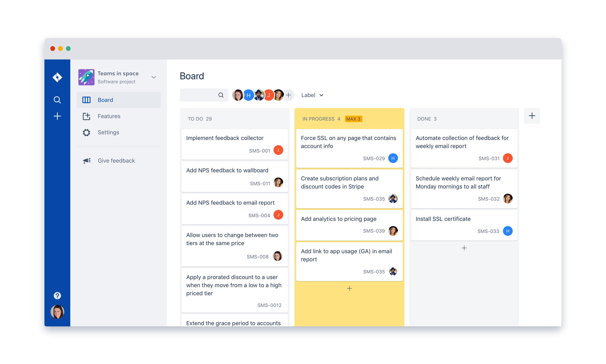

# Jira

Jira is especially designed for teams that adopt agile software development. Thus, teams develop products faster, and able to easily manage and track human resources. Jira has a kanban board view that everyone can see the current situation of the project. In that page, people in the team and the thing they are working on listed and explained.

Kanban board is a nice feature to have in a project management system. It clearly shows the human resources and how it is managed. In addition, it is easy to see the progress of the project. However, it is not the only feature that Jira has. It also has a scrum board view that is more suitable for teams that adopt scrum software development. In this view, the team can see the current sprint and the progress of the sprint. In addition, it is possible to see the backlog of the project. The backlog is a list of features that the team wants to implement in the future. The team can prioritize the features in the backlog and decide which feature to implement in the next sprint.

Scrum board is more specified in sprints rather than individual tasks. Thus the current goal is more clear than the kanban board. It is easier to determine the current goal and pave the pay.

Jira has a feature that you can see all of your projects' task situation. Thus you can see all the tasks in a page and manage them easily. In addition, it is possible to see the progress of the project in a graph. It is a nice feature to have in a project management system. It is easy to see the progress of the project and the current situation of the project.

![Jira 23(../../static/img/jira/jira-3.png)
